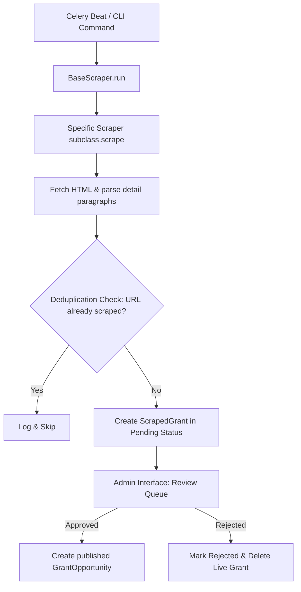

# Wajha Scholarship Scrapers App

This Django app automates the collection of scholarship and fellowship opportunities from external sources, placing them into an administrative review queue for verification before publishing them to users.

---

## 📂 Folder Structure

```text
scrapers/
│
├── management/
│   └── commands/
│       └── run_scrapers.py        # Management command for manual CLI runs
│
├── scraper_scripts/
│   ├── __init__.py                # Scraper registry (ALL_SCRAPERS)
│   ├── base_scraper.py            # Base class containing common engine logic
│   ├── opportunity_desk_scraper.py# Parser for Opportunity Desk
│   └── youthop_scraper.py         # Parser for Youth Opportunities
│
├── admin.py                       # Django admin configuration for staging models
├── apps.py                        # App configuration metadata
├── models.py                      # Database models (GrantSource, ScrapedGrant)
├── tasks.py                       # Celery tasks (for automated schedules)
├── urls.py                        # Scraper admin web endpoints
├── utils.py                       # General helper utilities
├── views.py                       # Admin review queue views
└── tests.py                       # Scraper test cases
```

---

## 🌐 Grant Sources

We automatically pull raw listings from the following platforms:
1. **Opportunity Desk**: [opportunitydesk.org](https://opportunitydesk.org/category/fellowships-and-scholarships/)
2. **Youth Opportunities**: [youthop.com](https://www.youthop.com/scholarships)

---

## ⚙️ How It Works (Workflow)



### 1. Triggering the Scrape
The scrapers can be triggered in two ways:
* **Celery Beat (Automated)**: Runs the Celery task (`scrapers.tasks.run_all_scrapers_task`) every **Monday at 3:00 AM** (00:00 UTC).
* **CLI (Manual)**: Run `python manage.py run_scrapers` to start all scrapers instantly.

### 2. Execution & Extraction
* The orchestrator (`BaseScraper.run()`) initializes a database entry tracking the source's health status.
* The subclass scraper sends HTTP requests to the target websites, fetches the HTML, and parses scholarship fields like:
  * Title, Description, Deadline
  * Countries, degree levels, fields of study, and eligibility text.

### 3. Deduplication Check
* To prevent flooding the review queue, the URL of the parsed scholarship is matched against existing records.
* If the scholarship has already been scraped, the scraper logs a debug statement and **skips it**.
* If it is new, a `ScrapedGrant` record is created in a **`pending`** status.

### 4. Admin Review Queue
* Admins view these entries at `/scrapers/`.
* Admins can approve a listing directly to the live page (`scraped_grant_approve`), save it as a draft (`scraped_grant_draft`), or reject it (`scraped_grant_reject`).

---

## 🛠️ Testing Locally

To manually run the scraper on your local development machine:

1. **Activate the environment**:
   ```bash
   ..\wajha_env\Scripts\activate
   ```
2. **Run all scrapers**:
   ```bash
   python manage.py run_scrapers
   ```
3. **Run a single scraper**:
   ```bash
   python manage.py run_scrapers --source "Opportunity Desk"
   ```
